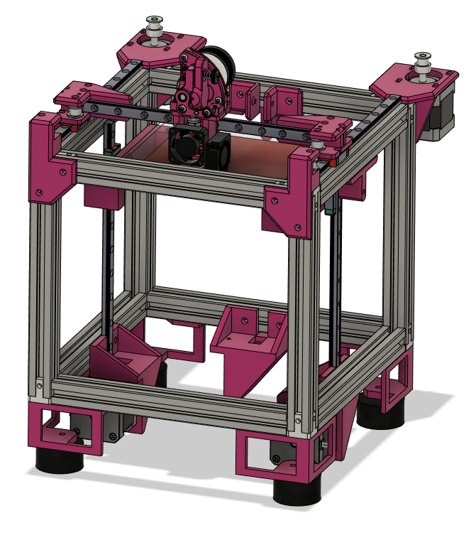

# Bijou
Welcome to the DIY 3D Printer called Bijou!

This is a tiny 110x110 H-Bot 3D Printer for biginner builders

PLEASE NOTE THIS PRINTER IS A WORK IN PROGRESS!

The goal of this printer is to make a cheap easy to build 3D printer than can be built by anyone.

Features:

- Simple 2020 Frame only 1 sizes needed, no drilling or taping
- Klicky Probe Support

BOM
https://docs.google.com/spreadsheets/d/1nYMNJQScirm3ykZU8kyfmQuEbCC1vtWDH2YyEYYs_pw/edit#gid=0

Support me on Patreon
https://www.patreon.com/rolohaun
